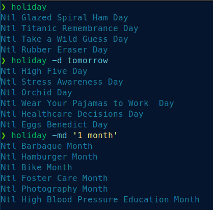

# ntl-cal
[](https://opensource.org/licenses/MIT) 

Calendar of International and National (US) holidays, scraped from a website.

## About
Each folder is named after the short name of the month (`strftime %b`). 
Within each folder are files named for each day, no extension. 
Each file contains newline-deliniated holiday names, in no particular order, 
with National abbreviated as Ntl.

`ntl-cal-public` will display, colored, the holidays for today. 
Replace `user` with your username, and update the path if nessecary. 
Then you can alias in your `.*shrc`, or move it to somewhere on your `$PATH`. 
Don't forget to make the file executable with `chmod +x`.
Run `ntl-cal -h` to see options.

Scraped from: http://www.nationalcalendarapp.com/

## example
(I aliased it to holiday because, while less unique, it's easier to type.)



Screenshot taken on Tilix using [powerlevel10k](https://github.com/romkatv/powerlevel10k) as prompt. Font is patched Melso from p10k. Colorscheme of my own making, not released (yet).


## Here's how I did it
```sh
$ mkdir Sep
$ cd Sep
$ for i in {1..31}; do curl "http://www.nationalcalendarapp.com/browse/2020/9/$i" -kO; done
$ for i in {1..31}; do python ../extract.py $i ; done
$ cd ..
```
And repeat for each month, subsituting `Sep` and `9` for the appropriate values.
Then, 
```sh
$ find . -type f -name "[0-9]" -print0 | xargs -0 sed -i'' -e 's/National/Ntl/ig'
$ find . -type f -name "[0-9][0-9]" -print0 | xargs -0 sed -i'' -e 's/National/Ntl/ig'
```

### Notes: 
Some pages aren't valid utf-8 (according to python) so I had to do them manually.

You need the `-k` flag because said site has an invalid cert. (Be careful, I guess.)

Produces empty files for 31 in some months, for 29 and 30 as well in Feburary. 
These files have no effect so I didn't remove them.
